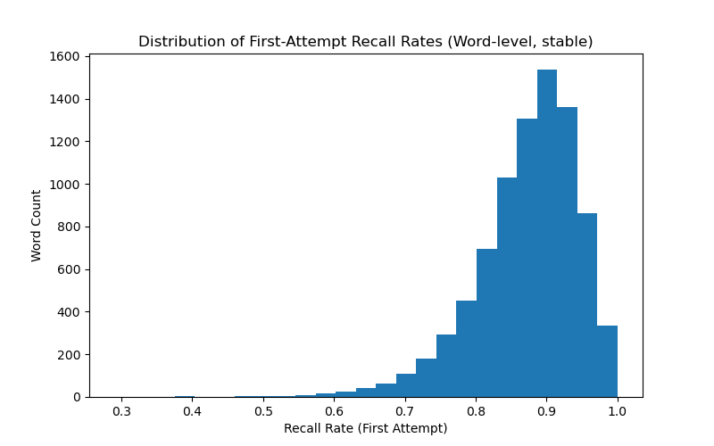

# Recall Rate

**Technical Documentation — Duolingo Spaced Repetition Dataset**

---

## 1. Overview

This document provides technical documentation for the **Recall Rate** metric, derived from the [Duolingo Spaced Repetition Dataset](https://www.kaggle.com/datasets/aravinii/duolingo-spaced-repetition-data?resource=download).

The goal of this metric is to measure **proportion of exercises from the certain practice where the word(lexeme) was correctly recalled**, offering insight into the success of spaced repetition in language retention.

This metric reflects **user memory strength**, **vocabulary difficulty**, and **the overall learning efficiency** of Duolingo's adaptive algorithm.

---

## 2. Purpose and Importance

In adaptive learning systems such as Duolingo, understanding how well users remember words after prior exposure is key to:

- Adjusting **review frequency** and **spaced repetition intervals**.
- Identifying **difficult words** that require more reinforcement.
- Measuring **learning progress** and user retention over time.
- Evaluating **experiment outcomes** (e.g., new hint features).

By analyzing Recall Rate, researchers and engineers can quantify how long users retain information between lessons and how effective the platform's scheduling algorithm is.

---

## 3. Metric Definition

**Metric Name:** Recall Rate
**Category:** User performance metric  
**Type:** Ratio / percentage  
**Scope:** Calculated per user-word pair and aggregated over sessions or cohorts

### Formal Definition

$$
\text{RecallRate}_{u,w} =
\frac{\text{# of words correctly recalled on first attempt}}
     {\text{# of words attempted for the first time}}
$$

- \(u\) = user ID
- \(w\) = word (lexeme)
- The numerator counts correct first attempts within a session.
- The denominator counts all words seen for the first time that session.

**Range:** 0 <= Recall Rate <= 1  
**Units:** Dimensionless (can be expressed as a percentage).

---

## 4. Dataset Schema

| Field             | Type     | Description                                      |
| ----------------- | -------- | ------------------------------------------------ |
| `user_id`         | int      | Unique learner identifier                        |
| `lexeme_string`   | string   | Encoded word or phrase practiced                 |
| `timestamp`       | datetime | Time of exposure                                 |
| `session_seen`    | int      | Number of exposures to the word within a session |
| `session_correct` | int      | Number of correct responses                      |
| `p_recall`        | float    | Proportion of correct to total seen attempts     |

Each record represents one user–word practice session.  
If `p_recall = 1.0` and `session_seen = 1`, we interpret this as a **successful first attempt**.

---

## 5. Computation Methodology

### Step-by-Step Algorithm

1. **Filter Valid Records**  
   Retain rows where `session_seen ≥ 1`.

2. **Define Correct First Attempt Flag**  
   Create a binary column:
   ```python
   first_attempt_correct = (p_recall == 1.0) & (session_seen == 1)
   ```
3. **Group by Word**
   Count how many times each word was attempted and how many times it was correctly recalled.

4. 88Compute Recall Rate\*\*
   recall_rate = correct_first_attempts / total_first_attempts

5. **Apply Stability Filter**
   Keep only words with at least 30 attempts to ensure statistically reliable results.

6. **Visualization**
Figure: Distribution of First-Attempt Recall Rates
<p align="center">  <br> <em>Figure 1. Distribution of first-attempt recall rates (word-level, stable).</em> </p>

**Analysis of the plot**
The histogram shows the distribution of recall rates across all words after applying the stability filter (MIN_COUNT = 30).
Most words have a high recall rate between 0.8 and 1.0, indicating that learners remember the majority of vocabulary items on their first attempt.
The distribution is right-skewed, with a strong concentration of words near perfect recall (0.9–1.0), suggesting effective long-term memory retention for common or well-practiced words.
Only a small number of words fall below 0.6, showing that truly difficult words are relatively rare.
Overall, this pattern demonstrates that Duolingo’s spaced-repetition algorithm helps learners retain most vocabulary efficiently, while a few low-recall words may require additional review or adjusted repetition intervals.
